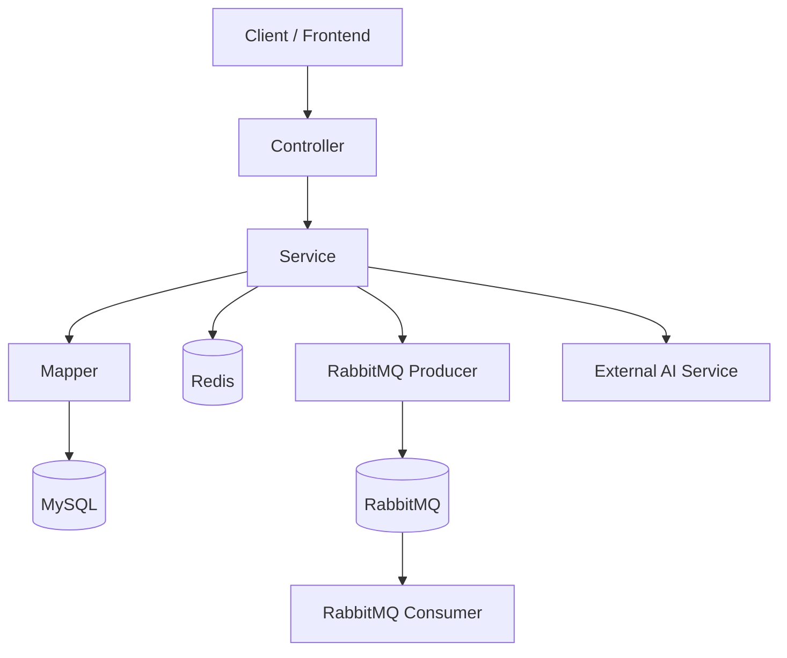

# MES 项目学习与面试讲解手册

> 适用项目：`E:\30天突击Offer\Java\mes`
>
> 文档目标：帮助你从“能跑项目”升级到“能讲项目、能应对面试追问”。

---

## 1. 项目概览

### 1.1 项目定位
这是一个典型的 **MES 后端服务**（偏设备运维场景），覆盖以下核心能力：

1. 用户认证与权限控制（JWT + Spring Security）
2. 设备管理（CRUD + 条件筛选 + Redis 列表缓存）
3. 工单管理（创建、分配、进度、状态流转 + 乐观锁）
4. 报表统计（MySQL 聚合 + Redis 缓存）
5. AI 辅助诊断（HttpClient 调 AI 接口 + 结果缓存 + mock 兜底）
6. 异步通知（RabbitMQ）

### 1.2 项目分层
采用了标准后端分层：

1. `controller`：接口层，接收请求/返回响应
2. `service`：业务抽象层（接口）
3. `service/impl`：业务实现层（核心逻辑）
4. `mapper`：数据访问层（MyBatis-Plus）
5. `entity`：数据库实体映射
6. `dto`：接口输入输出对象
7. `common/config/security`：通用能力与基础设施

---

## 2. 技术栈详解（面试常问）

## 2.1 Spring Boot
用途：

1. 快速搭建应用
2. 自动装配常见组件（Web、Security、Redis、RabbitMQ 等）

面试常问：

1. 什么是自动装配？`@SpringBootApplication` 做了什么？
2. Starter 机制原理是什么？

可讲点：

1. 本项目通过 starter 快速引入 Web/Security/Redis/RabbitMQ
2. 启动类用 `@MapperScan` 注册 MyBatis Mapper

## 2.2 Spring Security + JWT
用途：

1. 接口鉴权（未登录、无权限拦截）
2. 无状态认证（不依赖 Session）

本项目实现要点：

1. 登录接口 `/api/auth/login` 放行
2. `JwtAuthenticationFilter` 从 `Authorization` 头解析 Bearer Token
3. 解析角色写入 `SecurityContext`
4. 基于角色控制接口：如删除设备、报表接口需 `ADMIN`

面试常问：

1. 为什么用 JWT 而不是 Session？
2. JWT 如何做到无状态？如何处理过期？
3. 过滤器放在什么位置，为什么用 `addFilterBefore`？

可讲点：

1. 通过角色 claim 做 RBAC 控制
2. 通过统一异常处理返回 401/403 业务码

## 2.3 MyBatis-Plus + 乐观锁
用途：

1. 简化 CRUD 开发
2. 通过 `@Version` 防止并发写覆盖

本项目实现要点：

1. `MybatisPlusConfig` 注册 `OptimisticLockerInnerInterceptor`
2. `WorkOrder.version` 使用 `@Version`
3. 更新工单时传入 version，冲突时返回 `CONFLICT`

面试常问：

1. 乐观锁和悲观锁区别？
2. 乐观锁失败怎么处理？
3. 为什么工单场景适合乐观锁？

可讲点：

1. 并发更新冲突时给前端“刷新后重试”
2. 实现简单，吞吐高，适合读多写少

## 2.4 Redis
用途：

1. 设备列表缓存
2. 报表结果缓存
3. AI 诊断结果缓存

本项目亮点：

1. 设备列表采用“**版本号 + 条件哈希**”缓存键策略
2. 报表按查询维度哈希缓存，减少重复聚合 SQL
3. AI 结果缓存避免频繁调外部服务

面试常问：

1. 为什么不用“改动后删所有 key”而用版本号方案？
2. 缓存击穿、穿透、雪崩怎么处理？

可讲点：

1. 版本号策略降低删除成本，逻辑清晰
2. 缓存失败不影响主流程（容错）

## 2.5 RabbitMQ
用途：

1. 工单事件异步通知，解耦主流程与通知流程

本项目实现：

1. `WorkOrderEventProducer` 发送事件
2. `WorkOrderNotificationConsumer` 消费事件
3. 交换机、队列、绑定在 `RabbitMqConfig` 中统一声明

面试常问：

1. 为什么要异步？同步有什么问题？
2. 如何保证消息可靠性？
3. 幂等消费怎么做？

可讲点：

1. 主流程只负责写库 + 发事件，通知解耦
2. 后续可扩展短信、邮件、IM 通知

## 2.6 MySQL 聚合报表
用途：

1. 按日期和设备类型统计工单总数与完成数

面试常问：

1. 聚合 SQL 如何优化？
2. 索引怎么设计？
3. 为什么报表还需要缓存？

可讲点：

1. 用 `GROUP BY` 做结构化统计
2. 接口层只做汇总和完成率计算

## 2.7 Java HttpClient（AI 调用）
用途：

1. 调外部 AI 服务（POST JSON）
2. 配置连接超时和读取超时

面试常问：

1. 外部服务慢或失败怎么兜底？
2. 如何做重试和限流？

可讲点：

1. 本项目支持 mock 模式兜底
2. AI 调用结果进入 Redis，降低成本与延迟

## 2.8 Swagger / OpenAPI
用途：

1. 自动生成接口文档
2. 支持在线调试与 Bearer Token 认证

文档地址：

1. `http://localhost:8080/swagger-ui.html`
2. `http://localhost:8080/v3/api-docs`

---

## 3. 系统架构与核心链路

### 3.1 架构图



### 3.2 登录链路（JWT）

1. 前端调用 `/api/auth/login` 传用户名密码
2. `AuthServiceImpl` 通过 `AuthenticationManager` 校验
3. 查询角色并签发 JWT
4. 前端后续请求带 `Authorization: Bearer <token>`
5. `JwtAuthenticationFilter` 建立认证上下文
6. Security 依据角色放行/拒绝

### 3.3 设备列表缓存链路

1. 先读 `mes:device:list:version`
2. 拼接 `version + 查询参数` 后做 MD5 得缓存键
3. 命中 Redis 直接返回
4. 未命中查 MySQL 并回写缓存
5. 设备增删改后版本号自增，旧缓存自然失效

### 3.4 工单并发更新链路（乐观锁）

1. 前端携带当前 `version`
2. 更新 SQL 带上 `where id = ? and version = ?`
3. 影响行数 = 0 说明版本冲突
4. 返回冲突错误码，提示刷新后重试

### 3.5 AI 诊断链路

1. 先查缓存（请求内容哈希）
2. 命中缓存直接返回
3. 未命中根据配置：
   - `mock-enabled=true`：返回本地模拟结果
   - `mock-enabled=false`：调用外部 AI
4. 回写缓存并返回

---

## 4. 数据库设计要点

核心表：

1. `sys_users`：用户
2. `sys_roles`：角色
3. `sys_user_roles`：用户角色关系
4. `devices`：设备
5. `work_orders`：工单（含 `version` 乐观锁字段）

关系：

1. 用户与角色：多对多
2. 工单与设备：多对一（可选）
3. 工单与处理人：多对一（指向用户）

索引关注点：

1. 设备：`device_type`、`status`
2. 工单：`status`、`device_id`、`assignee_id`

---

## 5. 逐文件讲解版清单（学习 + 面试可讲点）

> 建议使用方式：每学完一行就自己回答“可讲点”，形成面试表达。

### 5.1 启动与公共层

| 文件 | 职责 | 学习重点 | 面试可讲点 |
|---|---|---|---|
| `pom.xml` | 依赖与构建配置 | Starter 组合、版本兼容 | 为什么选这些中间件 |
| `src/main/java/com/boatzhou/mes/MesApplication.java` | 启动入口 | `@SpringBootApplication`、`@MapperScan` | 自动装配 + Mapper 扫描 |
| `src/main/java/com/boatzhou/mes/common/ErrorCode.java` | 错误码枚举 | 业务码统一 | 前后端错误语义一致 |
| `src/main/java/com/boatzhou/mes/common/Result.java` | 统一返回体 | 泛型响应包装 | 统一响应标准化 |
| `src/main/java/com/boatzhou/mes/common/BusinessException.java` | 业务异常 | 可控抛错 | 服务层主动失败策略 |
| `src/main/java/com/boatzhou/mes/common/GlobalExceptionHandler.java` | 全局异常转换 | 多异常分类处理 | 异常治理与可观测性 |

### 5.2 配置层

| 文件 | 职责 | 学习重点 | 面试可讲点 |
|---|---|---|---|
| `src/main/java/com/boatzhou/mes/config/SecurityConfig.java` | 安全规则 | 接口放行、角色限制、过滤器链 | JWT 无状态鉴权设计 |
| `src/main/java/com/boatzhou/mes/config/MybatisPlusConfig.java` | MP 插件 | 乐观锁拦截器 | 并发一致性方案 |
| `src/main/java/com/boatzhou/mes/config/MyMetaObjectHandler.java` | 自动填充 | createdAt/updatedAt/version | 统一审计字段策略 |
| `src/main/java/com/boatzhou/mes/config/RabbitMqConfig.java` | MQ 拓扑 | Exchange/Queue/Binding | 异步解耦 |
| `src/main/java/com/boatzhou/mes/config/OpenApiConfig.java` | OpenAPI 信息 | 文档元数据 + BearerAuth | 文档驱动联调 |
| `src/main/java/com/boatzhou/mes/config/AiProperties.java` | AI 配置映射 | `@ConfigurationProperties` | 配置外置化 |

### 5.3 安全层

| 文件 | 职责 | 学习重点 | 面试可讲点 |
|---|---|---|---|
| `src/main/java/com/boatzhou/mes/security/JwtProperties.java` | JWT 配置载体 | 密钥、过期、前缀 | 安全配置参数化 |
| `src/main/java/com/boatzhou/mes/security/JwtTokenProvider.java` | JWT 签发与解析 | claims、验签、过期校验 | Token 结构与校验逻辑 |
| `src/main/java/com/boatzhou/mes/security/JwtAuthenticationFilter.java` | 请求鉴权过滤 | 从 header 到 SecurityContext | 无状态认证链路 |
| `src/main/java/com/boatzhou/mes/security/CustomUserDetailsService.java` | 用户加载 | 用户 + 角色转 GrantedAuthority | Security 认证底层 |

### 5.4 控制器层

| 文件 | 职责 | 学习重点 | 面试可讲点 |
|---|---|---|---|
| `src/main/java/com/boatzhou/mes/controller/AuthController.java` | 登录接口 | 入参校验、返回 token | 登录 API 设计 |
| `src/main/java/com/boatzhou/mes/controller/DeviceController.java` | 设备接口 | CRUD + 条件查询 | REST 资源化设计 |
| `src/main/java/com/boatzhou/mes/controller/WorkOrderController.java` | 工单接口 | 分配/进度/状态更新 | 工单状态管理 |
| `src/main/java/com/boatzhou/mes/controller/ReportController.java` | 报表接口 | 默认日期范围、筛选 | 报表接口建模 |
| `src/main/java/com/boatzhou/mes/controller/AiDiagnosisController.java` | AI 接口 | 请求校验、统一返回 | AI 能力服务化 |

### 5.5 Service 接口层

| 文件 | 职责 | 学习重点 | 面试可讲点 |
|---|---|---|---|
| `src/main/java/com/boatzhou/mes/service/AuthService.java` | 认证抽象 | 接口与实现分离 | 依赖倒置 |
| `src/main/java/com/boatzhou/mes/service/DeviceService.java` | 设备抽象 | CRUD 契约 | 业务边界定义 |
| `src/main/java/com/boatzhou/mes/service/WorkOrderService.java` | 工单抽象 | 状态更新契约 | 状态机式设计 |
| `src/main/java/com/boatzhou/mes/service/ReportService.java` | 报表抽象 | 统计接口契约 | 读模型设计 |
| `src/main/java/com/boatzhou/mes/service/AiDiagnosisService.java` | AI 抽象 | 诊断契约 | 外部能力封装 |

### 5.6 Service 实现层（重点）

| 文件 | 职责 | 学习重点 | 面试可讲点 |
|---|---|---|---|
| `src/main/java/com/boatzhou/mes/service/impl/AuthServiceImpl.java` | 登录业务 | 认证链 + token 签发 | JWT 登录完整链路 |
| `src/main/java/com/boatzhou/mes/service/impl/DeviceServiceImpl.java` | 设备业务 | 版本号缓存失效、动态条件查询 | 缓存一致性方案 |
| `src/main/java/com/boatzhou/mes/service/impl/WorkOrderServiceImpl.java` | 工单业务 | 乐观锁冲突处理、状态联动、事件发送 | 并发控制 + 状态流转 |
| `src/main/java/com/boatzhou/mes/service/impl/ReportServiceImpl.java` | 报表业务 | SQL 聚合 + 结果缓存 | 报表性能优化 |
| `src/main/java/com/boatzhou/mes/service/impl/AiDiagnosisServiceImpl.java` | AI 业务 | 外部调用、超时、mock 兜底、缓存 | 外部依赖治理 |

### 5.7 DTO 层

| 文件 | 职责 | 学习重点 | 面试可讲点 |
|---|---|---|---|
| `src/main/java/com/boatzhou/mes/dto/auth/LoginRequest.java` | 登录入参 | 参数校验 | 输入校验前置 |
| `src/main/java/com/boatzhou/mes/dto/auth/LoginResponse.java` | 登录出参 | token 信息结构 | 认证响应规范 |
| `src/main/java/com/boatzhou/mes/dto/device/DeviceCreateRequest.java` | 设备新增入参 | 状态枚举校验 | DTO 与实体隔离 |
| `src/main/java/com/boatzhou/mes/dto/device/DeviceUpdateRequest.java` | 设备更新入参 | 局部更新语义 | PATCH 风格思路 |
| `src/main/java/com/boatzhou/mes/dto/workorder/WorkOrderCreateRequest.java` | 工单创建入参 | 优先级范围 | 业务规则参数化 |
| `src/main/java/com/boatzhou/mes/dto/workorder/WorkOrderAssignRequest.java` | 分配入参 | version 必传 | 乐观锁前后端协同 |
| `src/main/java/com/boatzhou/mes/dto/workorder/WorkOrderProgressRequest.java` | 进度入参 | 0~100 校验 | 状态与进度联动 |
| `src/main/java/com/boatzhou/mes/dto/workorder/WorkOrderStatusRequest.java` | 状态入参 | 状态枚举校验 | 状态机约束 |
| `src/main/java/com/boatzhou/mes/dto/report/WorkOrderReportItem.java` | 报表明细行 | 维度统计结构 | 报表数据建模 |
| `src/main/java/com/boatzhou/mes/dto/report/WorkOrderReportResponse.java` | 报表汇总 | 总量 + 明细 | API 输出分层 |
| `src/main/java/com/boatzhou/mes/dto/ai/AiDiagnosisRequest.java` | AI 入参 | 异常描述建模 | AI 输入设计 |
| `src/main/java/com/boatzhou/mes/dto/ai/AiDiagnosisResponse.java` | AI 出参 | 置信度、缓存标记 | AI 可解释性输出 |

### 5.8 实体与枚举层

| 文件 | 职责 | 学习重点 | 面试可讲点 |
|---|---|---|---|
| `src/main/java/com/boatzhou/mes/entity/Device.java` | 设备实体 | 字段映射、自动填充 | 实体审计字段设计 |
| `src/main/java/com/boatzhou/mes/entity/SysUser.java` | 用户实体 | 用户状态字段 | 账号禁用策略 |
| `src/main/java/com/boatzhou/mes/entity/SysRole.java` | 角色实体 | roleCode 语义 | RBAC 基础 |
| `src/main/java/com/boatzhou/mes/entity/SysUserRole.java` | 用户角色关系 | 多对多映射 | 授权关系建模 |
| `src/main/java/com/boatzhou/mes/entity/WorkOrder.java` | 工单实体 | `@Version`、进度、完成时间 | 并发更新保护 |
| `src/main/java/com/boatzhou/mes/enums/DeviceStatus.java` | 设备状态枚举 | 状态定义集中化 | 魔法值治理 |
| `src/main/java/com/boatzhou/mes/enums/WorkOrderStatus.java` | 工单状态枚举 | 生命周期定义 | 状态机表达 |

### 5.9 数据访问层

| 文件 | 职责 | 学习重点 | 面试可讲点 |
|---|---|---|---|
| `src/main/java/com/boatzhou/mes/mapper/DeviceMapper.java` | 设备 CRUD | BaseMapper 用法 | ORM 效率开发 |
| `src/main/java/com/boatzhou/mes/mapper/SysUserMapper.java` | 用户查询 | 登录 SQL | 认证数据获取 |
| `src/main/java/com/boatzhou/mes/mapper/SysRoleMapper.java` | 角色查询 | 联表查角色 | 权限查询优化 |
| `src/main/java/com/boatzhou/mes/mapper/SysUserRoleMapper.java` | 用户角色关系 CRUD | 关系表操作 | RBAC 扩展 |
| `src/main/java/com/boatzhou/mes/mapper/WorkOrderMapper.java` | 工单 CRUD + 报表 SQL | 聚合查询 | 报表 SQL 设计 |

### 5.10 MQ 层

| 文件 | 职责 | 学习重点 | 面试可讲点 |
|---|---|---|---|
| `src/main/java/com/boatzhou/mes/mq/WorkOrderEvent.java` | 事件模型 | 事件字段设计 | 事件驱动建模 |
| `src/main/java/com/boatzhou/mes/mq/WorkOrderEventProducer.java` | 事件发送 | 发送时机 | 异步解耦价值 |
| `src/main/java/com/boatzhou/mes/mq/WorkOrderNotificationConsumer.java` | 事件消费 | 消费入口 | 后续幂等扩展 |

### 5.11 资源文件与测试

| 文件 | 职责 | 学习重点 | 面试可讲点 |
|---|---|---|---|
| `src/main/resources/application.yml` | 全局配置 | 多中间件配置 | 配置管理能力 |
| `src/main/resources/schema.sql` | 建表脚本 | 主外键、索引 | 数据模型设计 |
| `src/main/resources/data.sql` | 初始化数据 | 角色用户样例 | 演示数据准备 |
| `src/main/resources/static/index.html` | 启动页 | 文档入口提示 | 工程可用性 |
| `src/test/java/com/boatzhou/mes/MesApplicationTests.java` | 冒烟测试 | 测试框架连通 | 测试意识 |

---

## 6. 面试高频点（建议重点准备）

### 6.1 高频题目（你大概率会被问）

1. JWT 和 Session 的区别？为什么本项目选 JWT？
2. Spring Security 认证与鉴权分别发生在哪？
3. 乐观锁怎么实现？冲突后怎么处理？
4. Redis 缓存一致性怎么保证？
5. 报表为什么要缓存？SQL 聚合怎么优化？
6. RabbitMQ 为什么要引入？同步通知有什么问题？
7. AI 接口超时/失败时怎么保证业务可用？
8. 全局异常处理有什么价值？
9. 你的接口安全策略怎么设计的？
10. 这个项目如何扩展成微服务？

### 6.2 可展开“亮点话术”

1. **缓存设计亮点**：设备列表采用版本号失效方案，不需要扫描删除大量缓存 key。
2. **并发控制亮点**：工单更新使用乐观锁，避免并发写覆盖，冲突处理可控。
3. **解耦亮点**：工单通知走 MQ，核心链路不被通知逻辑阻塞。
4. **稳定性亮点**：AI 模块有 timeout + mock + cache，多层兜底提升可用性。
5. **工程化亮点**：统一返回体 + 全局异常 + Swagger 文档，联调效率高。

### 6.3 可讲的改进方向（进阶面试加分）

1. 引入 Refresh Token + 黑名单机制完善 JWT 续签与注销
2. 为 MQ 增加重试队列、死信队列、幂等消费
3. 报表引入离线汇总表，降低实时聚合压力
4. 为 AI 接口加入限流、熔断、重试策略
5. 增加审计日志与操作追踪（谁在何时改了什么）

---

## 7. 面试讲项目的推荐顺序（3~5分钟版）

1. 先说业务目标：设备 + 工单 + 报表 + AI 诊断
2. 再说技术选型：Spring Boot、Security+JWT、MyBatis-Plus、Redis、RabbitMQ
3. 重点讲两个“难点”：
   - 工单并发更新（乐观锁）
   - 设备/报表缓存一致性
4. 最后说稳定性与扩展性：
   - AI 调用兜底策略
   - MQ 解耦通知
   - 后续可扩展方向

---

## 8. 快速联调信息

1. Swagger UI：`http://localhost:8080/swagger-ui.html`
2. OpenAPI JSON：`http://localhost:8080/v3/api-docs`
3. 登录接口：`POST /api/auth/login`
4. 默认账号（见 `data.sql`）：`admin` / `operator`

---

## 9. 学习建议（落地执行）

1. 第一轮：只看 `controller + service/impl`，搞懂业务主流程
2. 第二轮：看 `security + config + mapper`，搞懂“为什么这样设计”
3. 第三轮：手写一遍“登录链路 + 乐观锁更新 + 缓存查询”
4. 第四轮：按本文第 6 节做模拟问答，形成你的口语表达

> 如果你愿意，我可以继续给你做“逐天学习计划版（7 天 / 14 天）”，每天精确到看哪些文件、回答哪些面试题。

---

## 10. 7天精确学习计划（可直接执行）

> 目标：7 天内达到“能独立讲清项目 + 能现场手写关键代码 + 能完成接口联调”。
>
> 建议每天投入：6~8 小时（最低 5 小时也可执行）。

### Day 1：项目骨架与运行链路（打地基）

时间安排：

1. 09:00-10:30：读项目结构、分层职责
2. 10:40-12:00：读启动与公共层
3. 14:00-16:00：读配置文件与数据库脚本
4. 19:00-20:30：复盘并输出笔记

必须完成：

1. 阅读文件
   - `pom.xml`
   - `src/main/java/com/boatzhou/mes/MesApplication.java`
   - `src/main/java/com/boatzhou/mes/common/*`
   - `src/main/resources/application.yml`
   - `src/main/resources/schema.sql`
   - `src/main/resources/data.sql`
2. 写出你的第一版“系统架构图”（手绘也行）
3. 说清楚每层职责（controller/service/mapper/entity）

当日产出（可检查）：

1. 一页分层职责笔记
2. 一页“请求从进到出”的流程图
3. 3分钟项目概述口播（录音）

### Day 2：认证与权限（面试高频）

时间安排：

1. 09:00-10:30：Security 规则与过滤器链
2. 10:40-12:00：JWT 签发/解析细节
3. 14:00-16:00：登录链路串讲
4. 19:00-20:30：手写小练习

必须完成：

1. 阅读文件
   - `src/main/java/com/boatzhou/mes/config/SecurityConfig.java`
   - `src/main/java/com/boatzhou/mes/security/*`
   - `src/main/java/com/boatzhou/mes/controller/AuthController.java`
   - `src/main/java/com/boatzhou/mes/service/impl/AuthServiceImpl.java`
2. 手写一次“登录流程伪代码”
3. 解释 `addFilterBefore` 为什么放在这个位置

当日产出（可检查）：

1. 一页“JWT vs Session”对比表
2. 一页“401/403 场景区分”
3. 能口头回答：JWT 如何验签、如何过期

### Day 3：设备模块 + 缓存策略

时间安排：

1. 09:00-10:30：设备 CRUD 业务流程
2. 10:40-12:00：动态条件查询
3. 14:00-16:00：Redis 缓存键策略
4. 19:00-20:30：画缓存失效时序图

必须完成：

1. 阅读文件
   - `src/main/java/com/boatzhou/mes/controller/DeviceController.java`
   - `src/main/java/com/boatzhou/mes/service/impl/DeviceServiceImpl.java`
   - `src/main/java/com/boatzhou/mes/entity/Device.java`
   - `src/main/java/com/boatzhou/mes/mapper/DeviceMapper.java`
2. 写出“版本号失效方案”优缺点
3. 模拟一次缓存命中与未命中流程

当日产出（可检查）：

1. 一页缓存 key 设计说明
2. 一页缓存一致性策略（为什么不删全量 key）
3. 能口头回答：缓存穿透/击穿/雪崩应对

### Day 4：工单模块 + 乐观锁 + MQ

时间安排：

1. 09:00-10:30：工单状态流转规则
2. 10:40-12:00：乐观锁冲突处理
3. 14:00-16:00：RabbitMQ 生产消费链路
4. 19:00-20:30：并发场景问答

必须完成：

1. 阅读文件
   - `src/main/java/com/boatzhou/mes/controller/WorkOrderController.java`
   - `src/main/java/com/boatzhou/mes/service/impl/WorkOrderServiceImpl.java`
   - `src/main/java/com/boatzhou/mes/entity/WorkOrder.java`
   - `src/main/java/com/boatzhou/mes/config/MybatisPlusConfig.java`
   - `src/main/java/com/boatzhou/mes/config/RabbitMqConfig.java`
   - `src/main/java/com/boatzhou/mes/mq/*`
2. 手写一次“where id=? and version=?”乐观锁 SQL 思路
3. 说清楚为什么发送 MQ 后主流程更稳定

当日产出（可检查）：

1. 一页工单状态机
2. 一页乐观锁失败处理流程
3. 一页 MQ 解耦收益说明

### Day 5：报表模块 + AI 模块

时间安排：

1. 09:00-10:30：报表 SQL 聚合逻辑
2. 10:40-12:00：报表缓存策略
3. 14:00-16:00：AI 调用链路与兜底
4. 19:00-20:30：外部依赖治理总结

必须完成：

1. 阅读文件
   - `src/main/java/com/boatzhou/mes/controller/ReportController.java`
   - `src/main/java/com/boatzhou/mes/service/impl/ReportServiceImpl.java`
   - `src/main/java/com/boatzhou/mes/mapper/WorkOrderMapper.java`
   - `src/main/java/com/boatzhou/mes/controller/AiDiagnosisController.java`
   - `src/main/java/com/boatzhou/mes/service/impl/AiDiagnosisServiceImpl.java`
   - `src/main/java/com/boatzhou/mes/config/AiProperties.java`
2. 解释“为什么 AI 需要 mock + cache + timeout”
3. 写出报表接口性能优化思路（索引/缓存/离线化）

当日产出（可检查）：

1. 一页报表聚合说明
2. 一页 AI 容错策略说明
3. 能口头回答：外部服务不可用时如何保障可用性

### Day 6：Postman 全链路联调（必须实操）

时间安排：

1. 09:00-10:30：导入环境变量与集合
2. 10:40-12:00：认证 + 设备链路测试
3. 14:00-16:00：工单 + 报表 + AI 链路测试
4. 19:00-20:30：异常/权限场景测试

必须完成：

1. 按第 11 节完整跑通 Postman 用例
2. 输出 10 条测试结果（成功/失败各若干）
3. 对 3 个异常场景截图留档（401、403、409）

当日产出（可检查）：

1. 一份 Postman 测试记录
2. 一页“我遇到的问题与修复”
3. 一页“接口联调清单”

### Day 7：面试表达强化（项目讲解日）

时间安排：

1. 09:00-10:30：整理项目讲稿（3分钟、8分钟版本）
2. 10:40-12:00：高频问答模拟
3. 14:00-16:00：二次梳理亮点与改进点
4. 19:00-20:30：最终演练（录音/录屏）

必须完成：

1. 完成两版讲稿
   - 3分钟：总览版
   - 8分钟：技术细节版
2. 按第 6 节高频题完成至少 20 问自测
3. 准备 5 个“可追问展开点”

当日产出（可检查）：

1. 两版讲稿
2. 高频题答题稿
3. 最终项目亮点清单（至少 8 条）

### 7天总验收标准

1. 能在 8 分钟内讲清楚项目架构、核心难点、解决方案
2. 能解释 JWT、乐观锁、缓存一致性、MQ 解耦、AI 兜底
3. 能现场写出登录流程、乐观锁更新流程、缓存查询流程伪代码
4. 能独立使用 Postman 完成全链路测试并定位常见问题

---

## 11. Postman 测试文档（含测试数据）

## 11.1 前置准备

1. 启动服务：`http://localhost:8080`
2. 准备中间件：MySQL、Redis、RabbitMQ 可用
3. 数据库导入：
   - `src/main/resources/schema.sql`
   - `src/main/resources/data.sql`
4. 打开 Swagger 核对接口：`http://localhost:8080/swagger-ui.html`

## 11.2 Postman 环境变量（Environment）

建议创建环境：`mes-local`

变量清单：

1. `baseUrl` = `http://localhost:8080`
2. `token_admin` = （空）
3. `token_operator` = （空）
4. `device_id` = （空）
5. `work_order_id` = （空）
6. `work_order_version` = （空）

## 11.3 Collection 建议结构

1. `01-Auth`
2. `02-Device`
3. `03-WorkOrder`
4. `04-Report`
5. `05-AI`
6. `99-Negative`

## 11.4 认证测试

### 11.4.1 管理员登录

- Method: `POST`
- URL: `{{baseUrl}}/api/auth/login`
- Body(JSON):

```json
{
  "username": "admin",
  "password": "123456"
}
```

Tests 脚本（保存 token）：

```javascript
pm.test("登录成功", function () {
  pm.response.to.have.status(200);
});
const json = pm.response.json();
pm.environment.set("token_admin", json.data.token);
```

### 11.4.2 运维账号登录

- Method: `POST`
- URL: `{{baseUrl}}/api/auth/login`
- Body(JSON):

```json
{
  "username": "operator",
  "password": "123456"
}
```

Tests 脚本：

```javascript
const json = pm.response.json();
pm.environment.set("token_operator", json.data.token);
```

## 11.5 设备模块测试

公共 Header：

1. `Authorization: Bearer {{token_admin}}`
2. `Content-Type: application/json`

### 11.5.1 新建设备

- `POST {{baseUrl}}/api/devices`

```json
{
  "deviceCode": "DV-30001",
  "deviceName": "输送线温度传感器C",
  "deviceType": "SENSOR",
  "status": "ONLINE",
  "location": "三号车间",
  "description": "测试新增设备"
}
```

Tests 脚本（提取 device_id）：

```javascript
const json = pm.response.json();
pm.environment.set("device_id", json.data.id);
```

### 11.5.2 查询设备列表

- `GET {{baseUrl}}/api/devices?status=ONLINE`

### 11.5.3 更新设备

- `PUT {{baseUrl}}/api/devices/{{device_id}}`

```json
{
  "status": "FAULT",
  "description": "测试更新状态为故障"
}
```

### 11.5.4 删除设备（管理员）

- `DELETE {{baseUrl}}/api/devices/{{device_id}}`

## 11.6 工单模块测试

### 11.6.1 创建工单

- `POST {{baseUrl}}/api/work-orders`

```json
{
  "title": "输送线温度异常排查",
  "description": "温度波动频繁，需现场排查",
  "deviceId": 1,
  "assigneeId": 2,
  "priority": 2
}
```

Tests 脚本（提取工单ID与版本）：

```javascript
const json = pm.response.json();
pm.environment.set("work_order_id", json.data.id);
pm.environment.set("work_order_version", json.data.version);
```

### 11.6.2 分配工单

- `PUT {{baseUrl}}/api/work-orders/{{work_order_id}}/assign`

```json
{
  "assigneeId": 2,
  "version": {{work_order_version}}
}
```

### 11.6.3 更新进度

- `PUT {{baseUrl}}/api/work-orders/{{work_order_id}}/progress`

```json
{
  "progress": 60,
  "version": {{work_order_version}}
}
```

执行后先 `GET /api/work-orders/{{work_order_id}}`，拿到新 version 再继续更新。

### 11.6.4 更新状态为完成

- `PUT {{baseUrl}}/api/work-orders/{{work_order_id}}/status`

```json
{
  "status": "COMPLETED",
  "version": {{work_order_version}}
}
```

## 11.7 报表与 AI 测试

### 11.7.1 报表查询（管理员）

- `GET {{baseUrl}}/api/reports/work-orders?startDate=2026-03-01&endDate=2026-03-07`
- Header: `Authorization: Bearer {{token_admin}}`

### 11.7.2 AI 诊断

- `POST {{baseUrl}}/api/ai/diagnosis`

```json
{
  "deviceCode": "DV-20001",
  "deviceStatus": "FAULT",
  "symptom": "电机振动异常且噪音升高"
}
```

## 11.8 负向用例（面试非常加分）

1. 未带 Token 访问 `/api/devices`，应返回未认证错误
2. `operator` 删除设备，应返回无权限错误
3. 工单更新传旧 version，应返回冲突错误
4. 设备状态传非法值，应返回参数校验错误
5. 登录错误密码，应返回认证失败

## 11.9 推荐测试数据（可直接用于联调）

> 如果你不想依赖 `data.sql`，可手动使用以下数据。

账号：

1. 管理员：`admin / 123456`
2. 运维员：`operator / 123456`

设备样例：

```json
[
  {
    "deviceCode": "DV-10001",
    "deviceName": "包装线温度传感器A",
    "deviceType": "SENSOR",
    "status": "ONLINE",
    "location": "一号车间"
  },
  {
    "deviceCode": "DV-20001",
    "deviceName": "冲压机电机B",
    "deviceType": "MOTOR",
    "status": "FAULT",
    "location": "二号车间"
  }
]
```

工单样例：

```json
[
  {
    "title": "温度传感器校准",
    "status": "PROCESSING",
    "progress": 60
  },
  {
    "title": "电机振动排查",
    "status": "PENDING",
    "progress": 0
  }
]
```

## 11.10 Postman 验收标准

1. 认证、设备、工单、报表、AI 五个模块接口全部跑通
2. 至少完成 5 个负向用例
3. 关键变量可自动串联（token、id、version）
4. 可输出一份测试结果截图用于面试展示
